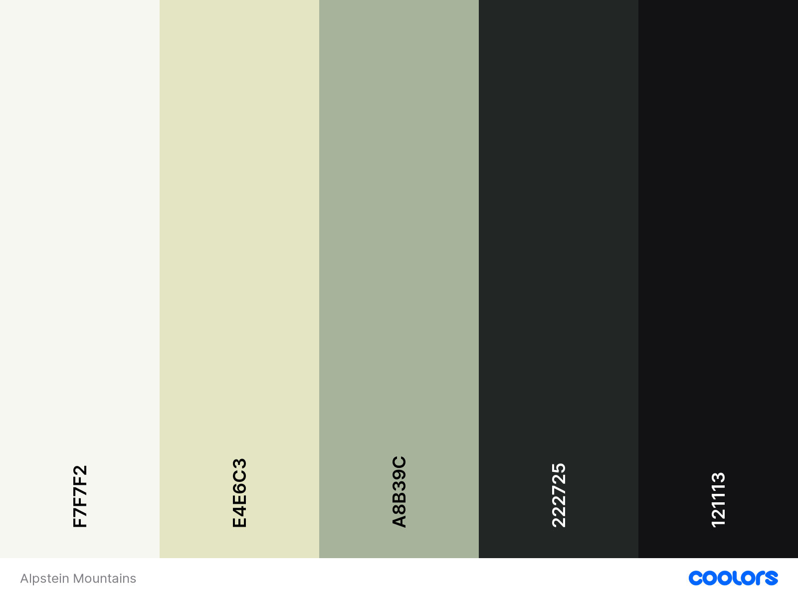
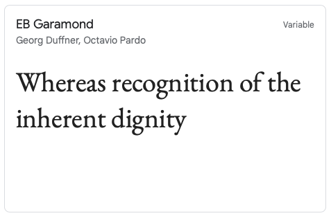
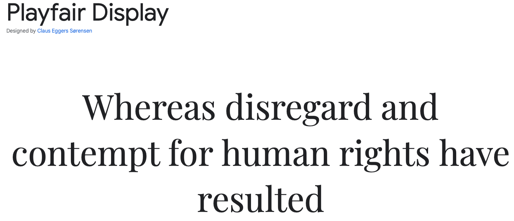
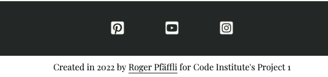
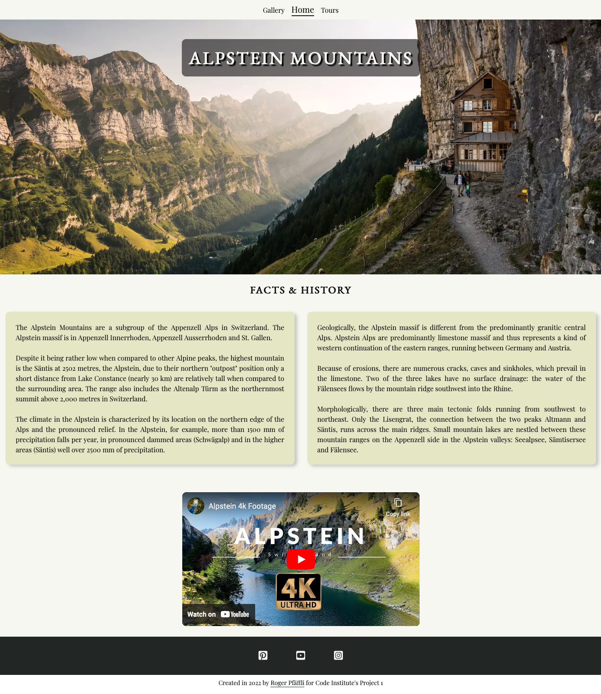
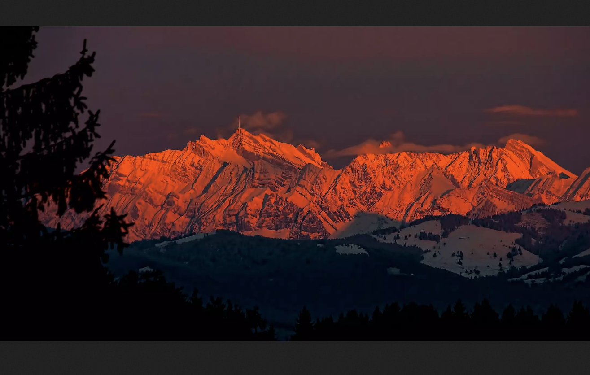

# Alpstein Mountains
The Alpstein Mountains are a part of the Appenzell Alps, located in eastern Switzerland. They are known for ther stunning and beautiful landscape and as a resort to hike, relax and enjoy nature.
This site is a starting point for anyone who wants to discover the Alpstein Mountains. The key point is to give a brief overview about the history and geology, show the beautiful landscapes and give some advice for hiking tours. Furthermore it serves as a contact point for taking a guided hike.
    
Link to deployed site: [Alpstein Mountains](https://rpf13.github.io/alpstein-mountains/)


## Contents

>TODO: Add links to each sections of the README

---

## UX & Design
The overall design is based on a clear, sleek design with minimalistic colors to make sure, the content speaks for itself.

This site has been built with the "mobile first" approach in mind. This results in a very responsive and easy to navigate site, independet of the medium, which is used to access it.

### User Stories
- As a visiting user, I would like to be immediately attracted by a stunning big picture of the Alpstein Mountains 
- As a visiting user, I would like to gain informations about the Alpstein Mountains
- As a visiting user, I would like to see a video, showing the beautiful area
- As a visiting user, I would like to enjoy a minimalistic web design, where the beautifulness of the mountains, shown via the pictures, speaks for itself
- As a visiting user, I would like to see a gallery of pictures to get an impression of the landscape
- As a visiting user, I would like to get some information about recommended tours
- As a visiting user, I would like to have a contact form to get more informations
- As a visiting user, I would like to see a map of the area, in order to understand, where these mountains are located

### Color Scheme
The colors chosen for this site follow the natural colors of the landscapes shown in the images. Colors are minimalistic and supportive, but do not distrub the look of the images.
I used [Coolors.co](https://coolors.co/f7f7f2-e4e6c3-a8b39c-222725-121113) to choose a visually appealing set of colors.



### Typography
I used [Google Fonts](https://fonts.google.com/) to choose and import clear and appealing fonts. "EB Garamond" for headers and "Playfair Display" for text. "Serif" acts as a backup font.




    
### Wireframes
As an initial step, before any code has been written, I have used Balsamiq to create a Mobile and a Desktop version of each site.

[Mobile Wireframes](docs/wireframes/Mobile.png)

[Desktop Wireframes](docs/wireframes/Desktop.png)
     
## Features
    
### Generic Features

This section describes some generic features, which can be found on each of the pages. All of these elements are fully responsive to any screen size.

- Navigation Bar and Hero Image
    - The Navigation Bar is a simple but beautifully crafted element. It consists of three navigation links to the Home, Gallery and Tours site. It has a hover effect on it, chaning the color and the active link is underlined.
    - The Hero main image is also the "main attraction" of every site, sicne it contains a carefully selected - stunning image of the Alpstein. To give it further expression, a zoom effect has been implemented. In the foreground of the hero image, the main title text appears, surounde by a smoky black box, which is slightly transparent in order keep the user's eye on the image itself.
    
    

- Footer
    - The footer is also present on each site and it contains links and the respective icons to the Youtube, Instagram and Pinterest page of the official Appenzell tourist page.
    - Underneath the footer, there is a small designation with a link to my Github repository - also including a hover effect.

    


### Main Site

This is the entry point to the project. Everything starts from here and therefore it gives some key information to keep the user interested.



- Facts & History Boxes
    - These two, fully responsive boxes will give some crucial information about the Alpstein Mountains, their location, the geology and some climate facts. The user should immediately get some information about the area, after looking at the stunning hero image.


- Embedded Youtube Video
    - As the final visual experience, a well choosen 4k drone video has been embedded. This Youtube video gives some more emotions about the area, supported by the well chosen background music.


### Gallery Site

The gallery contains a selection of beautiful images of the Alpstein region. The site is fully responsive and adapts to any screen size, the images automatically resize depending on the screensize but always keeping their aspect ratio.


- Fullscreen image in new tab
    - If the user clicks on one of the images, it will open in it's full size in a new tab. This is a logical consequence of having the gallery in the free floating form, as it is. The user should be able to view the image as a standalone image in new tab, not beeing disturbed by other images.




### Tours Site


### Features Left to Implement
have ideas on what you'd like to add in the future? add them here!! assessors LOVE seeing future concepts!

### Accessibility
    
## Technologies Used
I used the following technologies and resources to create this site:

- [HTML5](https://www.w3.org/standards/webdesign/htmlcss)
    - HTML5 has been used to build the structure of the site
- [CSS3](https://www.w3.org/standards/webdesign/htmlcss)
    - CSS3 has been used for the styling of the site
- [Balsamiq](https://balsamiq.com)
    - Balsamiq has been used to create the Wireframes
- [Google Fonts](https://fonts.google.com)
    - Google Fonts has been used to choose and import the Fonts
- [Coolors](https://coolors.co)
    - Coolors has been used to create a color scheme
- [Tinywow](https://tinywow.com)
    - Tinywow has been used to compress and reformat the images
- [Git](https://git-scm.com)
    - Git has been used as the CLI version control tool
- [Github](https://github.com)
    - Github has been used to store the code and publish the site via Github Pages
- [Gitpod](https://gitpod.io/)
    - Gitpod has been used as the local IDE environment
- [Am I responsive?](https://ui.dev/amiresponsive)
    - Am I responsive has been used to show an image of the site on various devices
- [Custom Youtube Embed Generator](https://www.classynemesis.com/projects/ytembed/)
    - The Custom Youtube Embed Generator has been used to set and remove YT features
- [Bitly](https://bitly.com)
    - Bitly has been used to shorten the URL's for the tours hiking link section
- [Webaim](https://webaim.org/resources/contrastchecker/)
    - WebAim has been used to check the contrast
- [Wave](https://wave.webaim.org)
    - Wave has been used to test the accessibility

---

## Development

>make a note about how I did the commit messages, my multiline approach and the tags I did use
>explain why I’ve used flexbox on single box sections like video and contact form (future proof, …)

---

## Testing
"For all testing, please refer to the [TESTING.md](TESTING.md) file."

---


## Deployment

The site was deployed to GitHub pages. The steps to deploy are as follows:
  - In the [GitHub repository](https://github.com/rpf13/alpstein-mountains), navigate to the Settings tab
  - In the Code and automation section, click on pages
  - From the branch section drop-down menu, select the Main Branch
  - Then click save. After a few minutes you can see that the page is deployed and live, showing the related link.

The live link can be found here [Alpstein Mountains](https://rpf13.github.io/alpstein-mountains/)

    
### Local Deployment

If you want to make your own copy of this project and work on it, you can clone it locally to your IDE of choice.
Inside the terminal of your IDE, use the following command:
```
git clone git@github.com:rpf13/alpstein-mountains.git
```

If you are using your IDE inside Gitpod or generally prefer to work with Gitpod instead of a local IDE, you can open
this project directly in Gitpod and and create your own workspace with it. To do so, klick on the following link: [Open in Gitpod](https://gitpod.io/#https://github.com/rpf13/alpstein-mountains)

Please note that in order to directly open the project in Gitpod, you need to have the browser extensions (Chrome, Firefox) installed. A tutorial on how to do that can be found [here](https://www.gitpod.io/docs/configure/user-settings/browser-extension).

---


## Credits

### Code

While creating this project, I did a lot of research *on how to do things* where I took the concepts learned in the LMS of Code Institute and did some further research. The most important resoucre was [w3schools.com](https://www.w3schools.com).
Nverethless, I have used the following resources in order to understand the related concept:

- Code for the hero image, footer and the google maps section was inspired from Code Institute's Love Running Walkthrough Project and the Coders Coffeehouse project, with some tweaks in order to fit my page
- [WikiHow's](https://www.wikihow.com/Embed-a-Google-Map-in-HTML) article about how to embed Google Maps helped me to understand how to add it.
- [Jamie Juviler's](https://blog.hubspot.com/website/css-transform) blogpost has helped me a lot to understand the CSS transform property in order to place the individual site titles in front of the hero image
- [Kevin Powel](https://www.youtube.com/kepowob) has been a huge inspiration and help in order to understand flexbox, especially the following [video](https://youtu.be/u044iM9xsWU)
- [CSS-Tricks](https://css-tricks.com/snippets/css/a-guide-to-flexbox/) has helped me a lot to implement flexbox, their cheatsheet was a great resource!
- [Custom Youtube Embed Generator](https://www.classynemesis.com/projects/ytembed/) has helped me to get the right code for removing unwanted tracking features on the embedded youtube video as well as set the necessary properties.


### Content

- The main content of the site including it's design idea is my own work.
- The text of the Facts & History sections was taken from the [English](https://en.wikipedia.org/wiki/Alpstein) and [German](https://de.wikipedia.org/wiki/Alpstein) Wikipedia article.
    
### Media

All media used in this project is taken from public available resources, respecting the relevant licenses. The following list shows where each element comes from.

#### Main Site

- [Hero image](https://unsplash.com/photos/o7LDdRDIYiY)
- [YouTube Video](https://youtu.be/dC9U4LVPeNM)

#### Gallery

- [Hero image](https://unsplash.com/photos/gHb7lxBFDuc)
- [Bollenwees](https://unsplash.com/photos/WlJHg46JtUg)
- [Saxer Luecke](https://unsplash.com/photos/qkLXiz60IjA)
- [Rotsteinpass](https://unsplash.com/photos/Zb6kF1l4HyA)
- [Saentis in Snow](https://unsplash.com/photos/u22BF2Kdn6k)
- [Churfirsten](https://unsplash.com/photos/JpArU3Oy74A)
- [Schaefler](https://unsplash.com/photos/tcHDtm4GhvM)
- [Seealpsee](https://unsplash.com/photos/FNaFLvbLFuk)
- [Seealpsee Clouds](https://unsplash.com/photos/ZclxlvUZHJc)
- [Saentis Winter Panorama](https://unsplash.com/photos/GvD4fShTvZU)

#### Tours

- [Hero image](https://unsplash.com/photos/O35LfbkVbRA)

    
### Acknowledgements

My biggest thanks go to my wife and my little son, who gave me the opportunity to work on this project and give me the support to do this training with Code Institute.

A huge thank you goes to my mentor Tim Nelson, who gave me a lot of inspiration, hints and advice. Thank you so much Tim, I've loved every minute of our mentor sessions!

The whole Code Institute Slack community was a big help and motivator. I thank all my fellow students for their advice and support!

A special thank goes also to Kera Cudmore for giving this awesome [tutorial](https://github.com/kera-cudmore/readme-examples) on how to create a good README file.

I would like to thank [w3schools.com](https://www.w3schools.com) for creating such an outstanding resource. Their site was my main resource to look up my questions and understand on how things work - Thank you!
    
