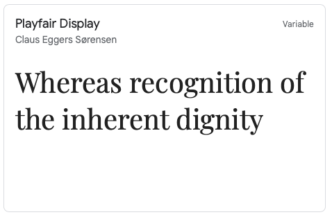
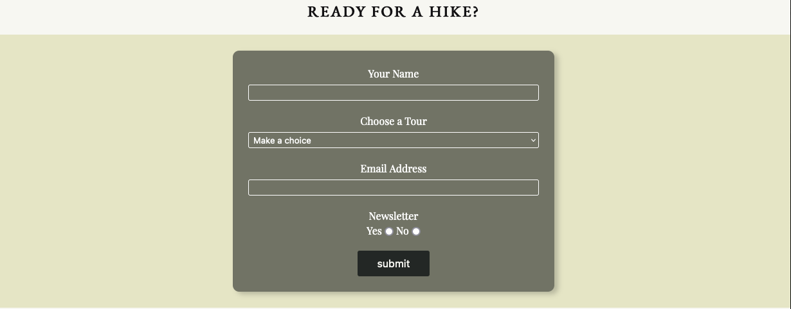
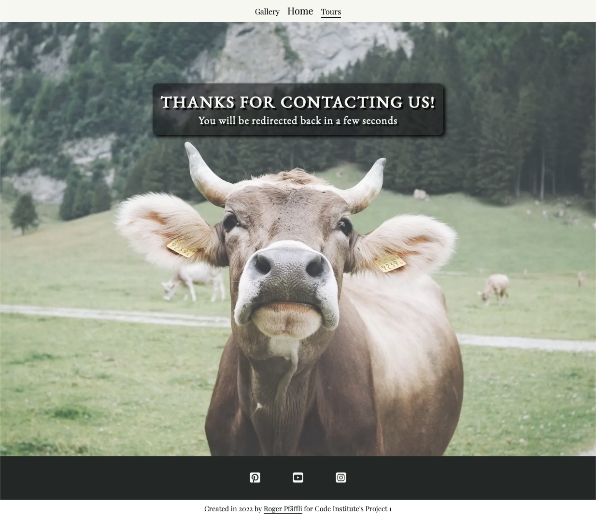

# Alpstein Mountains
The Alpstein Mountains are a part of the Appenzell Alps, located in eastern Switzerland. They are known for ther stunning and beautiful landscape and as a resort to hike, relax and enjoy nature.
This site is a starting point for anyone who wants to discover the Alpstein Mountains. The key point is to give a brief overview about the history and geology, show the beautiful landscapes and give some advice for hiking tours. Furthermore it serves as a contact point for taking a guided hike.
    
Link to deployed site: [Alpstein Mountains](https://rpf13.github.io/alpstein-mountains/)


## Contents

* [UX & Design](#ux--design)
    * [User Stories](#user-stories)
    * [Color Scheme](#color-scheme)
    * [Typography](#typography)
    * [Wireframes](#wireframes)
* [Features](#features)
    * [Generic Features](#generic-features)
    * [Main Site](#main-site)
    * [Gallery Site](#gallery-site)
    * [Tours Site](#tours-site)
    * [Confirmation Site](#confirmation-site)
    * [Features Left to Implement](#features-left-to-implement)
    * [Accessibility](#accessibility)
* [Technologies Used](#technologies-used)
* [Development](#development)
    * [Mobile First Approach](#mobile-first-approach)
    * [The use of Flexbox](#the-use-of-flexbox)
    * [Commit Messages](#commit-messages)
* [Testing](TESTING.md)
* [Deployment](#deployment)
    * [Local Deployment](#local-deployment)
* [Credits](#credits)
    * [Code](#code)
    * [Content](#content)
    * [Media](#media)
    * [Links to external sites](#links-to-external-sites)
    * [Acknowledgements](#acknowledgements)


---

## UX & Design
The overall design is based on a clear, sleek design with minimalistic colors to make sure, the content speaks for itself.

This site has been built with the "mobile first" approach in mind. This results in a very responsive and easy to navigate site, independet of the medium, which is used to access it.

### User Stories
- As a visiting user, I would like to be immediately attracted by a stunning big picture of the Alpstein Mountains 
- As a visiting user, I would like to gain informations about the Alpstein Mountains
- As a visiting user, I would like to see a video, showing the beautiful area
- As a visiting user, I would like to enjoy a minimalistic web design, where the beautifulness of the mountains, shown via the pictures, speaks for itself
- As a visiting user, I would like to see a gallery of pictures to get an impression of the landscape
- As a visiting user, I would like to get some information about recommended tours
- As a visiting user, I would like to have a contact form to get more informations
- As a visiting user, I would like to get a confirmation, that sending the contact form was successful
- As a visiting user, I would like to see a map of the area, in order to understand, where these mountains are located

### Color Scheme
The colors chosen for this site follow the natural colors of the landscapes shown in the images. Colors are minimalistic and supportive, but do not distrub the look of the images.
I used [Coolors.co](https://coolors.co/f7f7f2-e4e6c3-a8b39c-222725-121113) to choose a visually appealing set of colors.


### Typography
I used [Google Fonts](https://fonts.google.com/) to choose and import clear and appealing fonts. "EB Garamond" for headers and "Playfair Display" for text. "Serif" acts as a backup font.



    
### Wireframes
As an initial step, before any code has been written, I have used Balsamiq to create a Mobile and a Desktop version of each site.

[Mobile Wireframes](docs/wireframes/Mobile.png)

[Desktop Wireframes](docs/wireframes/Desktop.png)

---
     
## Features
    
### Generic Features

This section describes some generic features, which can be found on each of the pages. All of these elements are fully responsive to any screen size.

- Navigation Bar and Hero Image
    - The Navigation Bar is a simple but beautifully crafted element. It consists of three navigation links to the Home, Gallery and Tours site. It has a hover effect on it, chaning the color and the active link is underlined.
    - The Hero main image is also the "main attraction" of every site, sicne it contains a carefully selected - stunning image of the Alpstein. To give it further expression, a zoom effect has been implemented. In the foreground of the hero image, the main title text appears, surounde by a smoky black box, which is slightly transparent in order keep the user's eye on the image itself.
    
    

- Footer
    - The footer is also present on each site and it contains links and the respective icons to the Youtube, Instagram and Pinterest page of the official Appenzell tourist page.
    - Underneath the footer, there is a small designation with a link to my Github repository - also including a hover effect.

    


### Main Site

This is the entry point to the project. Everything starts from here and therefore it gives some key information to keep the user interested. It attracts the visitor with a stunning hero image of the Aescher, a house which is partially built inside the mountain. The other repeating parts have been explained in the [Generic Features](#generic-features) section.


- Facts & History Boxes
    - These two, fully responsive boxes will give some crucial information about the Alpstein Mountains, their location, the geology and some climate facts. The user should immediately get some information about the area, after looking at the stunning hero image.

    

- Embedded Youtube Video
    - As the final visual experience, a well choosen 4k drone video has been embedded. This Youtube video gives some more emotions about the area, supported by the well chosen background music.

    


### Gallery Site

The gallery contains a selection of beautiful images of the Alpstein region. It welcomes the user again with a stunning hero image, as described in the [Generic Features](#generic-features) section. The site is fully responsive and adapts to any screen size, the images automatically resize depending on the screensize but always keeping their aspect ratio.


- Fullscreen image in new tab
    - If the user clicks on one of the images, it will open in it's full size in a new tab. This is a logical consequence of having the gallery in the free floating form, as it is. The user should be able to view the image as a standalone image in new tab, not beeing disturbed by other images.

    


### Tours Site

The tours site is the main entry point to get active or to think about getting active in the Alpseint Mountains. Again, it is fully responsive to any screen size. Despite the beautiful hero image, as already explained in the [Generic Features](#generic-features) section, it offers information about how to discover the area.


- Awesome Tours Section
    - *Explore the Alpstein* This section welcomes the user with a motivation description on what to expect in this beautiful area. It encourages people in any hiking experience level to come to the Alpstein and enjoy the nature.
    - *The Choice is Yours!* This section explains the usage of the 6 tour proposals and what is waiting behind it. It also motivates the visitor to use the contact form to get further infos.
    - The associated hiking suggestion, located in a separate box, contain a brief description of the route and also a *well known* info button (similar to the tourist info symbol), which tunrs green when hovering over it. The green color is on purpose, since the mentioned tourist info symbol is usually green. When clicking on one of these buttons, the user gets redirected to the official tourist page of Appenzell Tourism, with all the infos of the related hiking tour, including the opton of GPX file download and much more.

    

    - Clicking on the button opens, as previously mentioned, the official Appenzell Tourist page in a new tab

    

- The Ready For a Hike contact form
    - This section is basically a contact form for users who want to come on a guided tour or get more information about a particular tour. The user must enter his name, email address and choose the tour he is interested in. He also has to make a choice if a newsletter is wanted or not. All fields are mandatory. After pushing the submit button, he will be redirected to the [confirmation site](#confirmation-site).

    

- The embeded Google Map
    - The last section of the site has a Google Map embeded. The displayed map is "centered" to the Alpstein waypoint and shows the mount Saentis surrounded by the Alpstein. It gives the user the possiblity to quickly find and navigate to the area. The map is fully interactive, can be zoomed or opened on a larger scale in a new browser window.

    


### Confirmation Site

The confirmation site is not a page, which is directly accessible to the visiting user. However, it play an important part, because once the user has filled in the contact form on the [tours site](#tours-site) and has clicked the submit button, he needs a feedback, that this *action* was succesful.

Once redirected to this confirmation page, the user gets welcomed by a big, funny hero image displaying a cow. Since this is more or less the only content on this site (the informative text is an overlay), the hero image has a bigger height on this site than on the others. Furthermore, the title text is 5% more lowered in order to have the users attention pointed to it.

The text displayed in the title text box give the user confirmation, that his action of sending the form, was successful. Furthermore it tells the user what just will happen - he will be redirected back in a few seconds. The timer is set to 10s and as the text says, it points back to the page where he came from, the tours site.




### Features Left to Implement

- The main site, the Facts & History section should get a third box, which gives some interesting information about the history of the touristic enablement of area and the pro's and con's, which this brought to the area.
- A possible statistic about the Alpstein (visitors, hiking accidents, ...) can be added
- The main site should then also get one or two more YouTube videos showing the touristic activities from recent years.

- The Gallery site should get more and more pictures

- The Tours site should get a few more tour examples. 
- The Tours site could get an active weather forecast widget included. This will be a benefit for the user.
- The Tours site should get another section showing the varius lift's, cable car's and gondolas in the area, which would help the user to decide where to go, depending on his abilities.

### Accessibility

I made quite some efforts to include the accessibility aspects into this page. I did even skip some nice effects, in order to be compliant to accessibility checks. On the tours site, I had a nice background image on one box, but during testing accessibility / contrast, I figured out it would (partially) fail the test, depending on which position, the background sits. I could not find any settign to overcome this and pass the check, so I've deleted it, in favor of the accessibility.


- All links to external sources contain an aria-label with a descriptive text. My [research](https://developer.mozilla.org/en-US/docs/Web/Accessibility/ARIA/Attributes/aria-label) has shown that on the iframe used for the YouTube video, the aria-label is not necessary, since it already contains a title.

- All images contain an alt attribute with a descriptive text.
- Like mentioned, I've tried to pay great attention to good contrast, which was quite a challenge when integrating images with foreground text, in a resonsive approach, where the front-, and background are not always on the same position.

---

## Technologies Used
I used the following technologies and resources to create this site:

- [HTML5](https://www.w3.org/standards/webdesign/htmlcss)
    - HTML5 has been used to build the structure of the site
- [CSS3](https://www.w3.org/standards/webdesign/htmlcss)
    - CSS3 has been used for the styling of the site
- [Balsamiq](https://balsamiq.com)
    - Balsamiq has been used to create the Wireframes
- [Google Fonts](https://fonts.google.com)
    - Google Fonts has been used to choose and import the Fonts
- [Coolors](https://coolors.co)
    - Coolors has been used to create a color scheme
- [Tinywow](https://tinywow.com)
    - Tinywow has been used to compress and reformat the images
- [Git](https://git-scm.com)
    - Git has been used as the CLI version control tool
- [Github](https://github.com)
    - Github has been used to store the code and publish the site via Github Pages
- [Gitpod](https://gitpod.io/)
    - Gitpod has been used as the local IDE environment
- [Am I responsive?](https://ui.dev/amiresponsive)
    - Am I responsive has been used to show an image of the site on various devices
- [Custom Youtube Embed Generator](https://www.classynemesis.com/projects/ytembed/)
    - The Custom Youtube Embed Generator has been used to set and remove YT features
- [Bitly](https://bitly.com)
    - Bitly has been used to shorten the URL's for the tours hiking link section
- [Webaim](https://webaim.org/resources/contrastchecker/)
    - WebAim has been used to check the contrast
- [Wave](https://wave.webaim.org)
    - Wave has been used to test the accessibility

---

## Development

The following arguments describe *why and how* I have choosen to code certain parts the way they are. This section should give an explanation to my thinking process and explain the reader some conceptual decisions.

### Mobile First Approach

After watching the very [inspiring video](https://youtu.be/JcaX60ZscgA) of Rebecca_CI and Franciska_CI, I really wanted to go the mobile first route. Initially I had planned to do desktop first, but the mobile first approach, paired with the awesome features, which flexbox brings (see [flexbox section](#the-use-of-flexbox)), convinced me to do mobile first.
Actually when developing the site, I had used the inspect tools of the browser and set the screen size of the preview tool to 450px width. The I have scaled it up to verify function and design.

Above mentioned arguments are also the reason, **why no media query has been used**, since I came to the conclusion, that modern CSS tools, paired with a mobile first design in mind, can avoid this step.

### The use of Flexbox

I was reading a lot about flexbox (see [Credits Section](#credits) for detailed links), since it got mentioned everywhere in the slack community. I really liked the approach and the benefits it brings and therefore I have used it throughout this project - also on places where it might not have been really necessary like embedded YouTube movie or the contact form section. However, the following reasons explain why I have used it:

- Flexbox brings amazing features to make a *section* or an *element* responsive to any screen size. With this in minde, a mobile first approach cna be easily implemented.
- It makes a section kind of future proof and easy to expand and this is also one of the main reasons I have used it on the previously mentioned sections. In future, I can add another Youtube Video or some more content to the contact form seccion and everythign is still responsive and very well placed. The desing of the code is future proof.

### Commit messages

- I have decided to mostly use multiline commit messages. Commit messages are an essential part of the whole project and a single line commit message is just not enough to explain. After reading [this interesting article](https://cbea.ms/git-commit/), it was clear to me, that I have to use it.

- I have decided to use conventional commits, as described this [cheatsheet](https://cbea.ms/git-commit/) or as also described in the LMS of the Code Institute. I did use the following sytax guidline:
    * **feat:** for feature which may or may not include a CSS part
	* **fix:** for a bugfix
	* **style:** for changes to CSS or to give style to the code itself
	* **docs:** for changes related to documentation
	* **refactor:** for refactored code, re-written code
	* **maint:** for general maintenance


---

## Testing

Testing is covered in a separate page, view [testing.md](TESTING.md)

---


## Deployment

The site was deployed to GitHub pages. The steps to deploy are as follows:
  - In the [GitHub repository](https://github.com/rpf13/alpstein-mountains), navigate to the Settings tab
  - In the Code and automation section, click on pages
  - From the branch section drop-down menu, select the Main Branch
  - Then click save. After a few minutes you can see that the page is deployed and live, showing the related link.

The live link can be found here [Alpstein Mountains](https://rpf13.github.io/alpstein-mountains/)

    
### Local Deployment

If you want to make your own copy of this project and work on it, you can clone it locally to your IDE of choice.
Inside the terminal of your IDE, use the following command:
```
git clone git@github.com:rpf13/alpstein-mountains.git
```

If you are using your IDE inside Gitpod or generally prefer to work with Gitpod instead of a local IDE, you can open
this project directly in Gitpod and and create your own workspace with it. To do so, klick on the following link: [Open in Gitpod](https://gitpod.io/#https://github.com/rpf13/alpstein-mountains)

Please note that in order to directly open the project in Gitpod, you need to have the browser extensions (Chrome, Firefox) installed. A tutorial on how to do that can be found [here](https://www.gitpod.io/docs/configure/user-settings/browser-extension).

---


## Credits

### Code

While creating this project, I did a lot of research *on how to do things* where I took the concepts learned in the LMS of Code Institute and did some further research. The most important resoucre was [w3schools.com](https://www.w3schools.com).
Nverethless, I have used the following resources in order to understand the related concept:

- Code for the hero image, footer and the google maps section was inspired from Code Institute's Love Running Walkthrough Project and the Coders Coffeehouse project, with some tweaks in order to fit my page
- [WikiHow's](https://www.wikihow.com/Embed-a-Google-Map-in-HTML) article about how to embed Google Maps helped me to understand how to add it.
- [Jamie Juviler's](https://blog.hubspot.com/website/css-transform) blogpost has helped me a lot to understand the CSS transform property in order to place the individual site titles in front of the hero image
- [Kevin Powel](https://www.youtube.com/kepowob) has been a huge inspiration and help in order to understand flexbox, especially the following [video](https://youtu.be/u044iM9xsWU)
- [CSS-Tricks](https://css-tricks.com/snippets/css/a-guide-to-flexbox/) has helped me a lot to implement flexbox, their cheatsheet was a great resource!
- [Custom Youtube Embed Generator](https://www.classynemesis.com/projects/ytembed/) has helped me to get the right code for removing unwanted tracking features on the embedded youtube video as well as set the necessary properties.
- [How to write a Git Commit Message](https://cbea.ms/git-commit/) has helped to understand the importance of multiline commit messages, which I have have heavily used in the project.


### Content

- The main content of the site including it's design idea is my own work.
- The text of the Facts & History sections was taken from the [English](https://en.wikipedia.org/wiki/Alpstein) and [German](https://de.wikipedia.org/wiki/Alpstein) Wikipedia article.
    
### Media

All media used in this project is taken from public available resources, respecting the relevant licenses. The following list shows where each element comes from.

#### Main Site

- [Hero image](https://unsplash.com/photos/o7LDdRDIYiY)
- [YouTube Video](https://youtu.be/dC9U4LVPeNM)

#### Gallery

- [Hero image](https://unsplash.com/photos/gHb7lxBFDuc)
- [Bollenwees](https://unsplash.com/photos/WlJHg46JtUg)
- [Saxer Luecke](https://unsplash.com/photos/qkLXiz60IjA)
- [Rotsteinpass](https://unsplash.com/photos/Zb6kF1l4HyA)
- [Saentis in Snow](https://unsplash.com/photos/u22BF2Kdn6k)
- [Churfirsten](https://unsplash.com/photos/JpArU3Oy74A)
- [Schaefler](https://unsplash.com/photos/tcHDtm4GhvM)
- [Seealpsee](https://unsplash.com/photos/FNaFLvbLFuk)
- [Seealpsee Clouds](https://unsplash.com/photos/ZclxlvUZHJc)
- [Saentis Winter Panorama](https://unsplash.com/photos/GvD4fShTvZU)

#### Tours

- [Hero image](https://unsplash.com/photos/O35LfbkVbRA)

### Links to external sites

The footer contains links to external social media profiles of the official Appenzell Tourism Page. Furthermore, the links behind the hiking tours section, redirect the user to the official Appenzell Tourism Page and the realted tour info of their site.
The YouTube video on the main page is embedded via YouTube from the *Swiss Sky Fly* channel.

- [Pinterest Appenzell Tourism](https://www.pinterest.ch/alpstein/)
- [YouTube Appenzell Tourism](https://www.youtube.com/user/apptour)
- [Instagram Appenzell Tourism](https://www.instagram.com/appenzellerland/)
- [Appenzell Tourism Hiking Tours](https://www.appenzell.ch/en/alpstein/hiking/hiking-tour-suggestions.html)
- [Swiss Sky Fly YouTube Channel](https://www.youtube.com/channel/UCy5hLS6YfNF2Qa2DPoVMN5g/videos)


    
### Acknowledgements

My biggest thanks go to my wife and my little son, who gave me the opportunity to work on this project and give me the support to do this training with Code Institute.

A huge thank you goes to my mentor Tim Nelson, who gave me a lot of inspiration, hints and advice. Thank you so much Tim, I've loved every minute of our mentor sessions!

The whole Code Institute Slack community was a big help and motivator. I thank all my fellow students for their advice and support!

A special thank goes also to Kera Cudmore for giving this awesome [tutorial](https://github.com/kera-cudmore/readme-examples) on how to create a good README file.

I would like to thank [w3schools.com](https://www.w3schools.com) for creating such an outstanding resource. Their site was my main resource to look up my questions and understand on how things work - Thank you!
    
