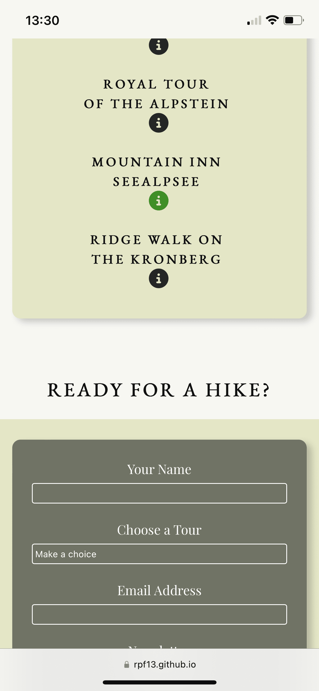

## Testing

This part covers all the testing sections in order to proof proper functionality.

## Contents

* [User Testing](#user-testing)
    * [User Stories Testing](#user-stories-testing)
    * [Browser Testing](#browser-testing)
    * [Responsiveness Testing](#responsiveness-testing)
* [Known Bugs](#known-bugs)
* [Validator Testing](#validator-testing)
    * [HTML Validator](#html-validator)
    * [CSS Validator](#css-validator)
    * [Lighthouse Testing](#lighthouse-testing)

---

### User Testing

I have tested the site on various devices and different browsers. Furthermore friends and family did check it out and no one reported an issue.

### User Stories Testing

- As a visiting user, I would like to be immediately attracted by a stunning big picture of the Alpstein Mountains

    

- As a visiting user, I would like to gain informations about the Alpstein Mountains

    

- As a visiting user, I would like to see a video, showing the beautiful area

    

- As a visiting user, I would like to enjoy a minimalistic web design, where the beautifulness of the mountains, shown via the pictures, speaks for itself
    - The Am I Responsive snapshot gives a good view on the sleek and minimalistic design, keeping the beautiful images as the main attraction.

    

- As a visiting user, I would like to see a gallery of pictures to get an impression of the landscape

    

- As a visiting user, I would like to get some information about recommended tours
    - Some generic info about the tours is given in the "Explore the Alpstein" section, but even more info can be gathered from the tour options and their links behind.

    

- As a visiting user, I would like to have a contact form to get more informations

    

- As a visiting user, I would like to get a confirmation, that sending the contact form was successful

    

- As a visiting user, I would like to see a map of the area, in order to understand, where these mountains are located

    

### Browser Testing

The project has been developed on a Mac with Firefox as main browser. Safari has been used for cross checking, while developing. I have tested the site on all possible browsers, also under Windows.

- Firefox


- Safari


- Chrome


- Edge


### Responsiveness Testing

Thoroughout the projec,t I did always verify responsiveness via the developer tools in the browser. However, as mentioned in the development section of the [README](README.md) file, the project was developed with a minimal screen size in a mobiel first approach. This has helped me to always be responsive, also when increasing the screen sizes.
However, here some snapshots taken on an iPhone 12 Pro:

- iPhone





- iPad


---

## Known Bugs

While doing the CSS part and styling, I did use a regular expression in order to summary the hero image part, which is shared among all of the hero images. It worked fine, however, there seems to be a gut that the baground-size attribute get's ignored. I could not make it to run, once I had this property in the regex, I had to specify under each id selector.

```css
[id^=hero-image-]{
    height: 100%;
    background-size: cover;
    animation-name: hero-image-zoom;
    animation-duration: 5s;
    animation-fill-mode: forwards;
}

/* background size property did not work inside above's regex, therefore individually set like: */

#hero-image-main {
    background: url('../images/p10_aescher.webp') no-repeat center right;
    background-size: cover;
}
```

---

## Validator Testing

### HTML Validator

### CSS Validator

### Lighthouse Testing

---