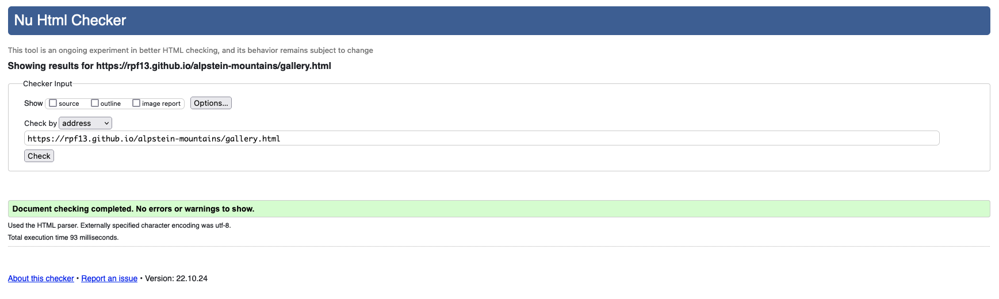

## Testing

This part covers all the testing sections in order to proof proper functionality.

## Contents

* [User Testing](#user-testing)
    * [User Stories Testing](#user-stories-testing)
    * [Browser Testing](#browser-testing)
    * [Responsiveness Testing](#responsiveness-testing)
* [Bugs](#bugs)
    * [Known Bugs](#known-bugs)
    * [Fixed Bugs](#fixed-bugs)
* [Validator Testing](#validator-testing)
    * [HTML Validator](#html-validator)
    * [CSS Validator](#css-validator)
    * [Lighthouse Testing](#lighthouse-testing)
    * [Wave Webaim Validator](#wave-webaim-validator)

---

### User Testing

I have tested the site on various devices and different browsers. Furthermore friends and family did check it out and no one reported an issue.

### User Stories Testing

- As a visiting user, I would like to be immediately attracted by a stunning big picture of the Alpstein Mountains

    

- As a visiting user, I would like to gain informations about the Alpstein Mountains

    

- As a visiting user, I would like to see a video, showing the beautiful area

    

- As a visiting user, I would like to enjoy a minimalistic web design, where the beautifulness of the mountains, shown via the pictures, speaks for itself
    - The Am I Responsive snapshot gives a good view on the sleek and minimalistic design, keeping the beautiful images as the main attraction.

    

- As a visiting user, I would like to see a gallery of pictures to get an impression of the landscape

    

- As a visiting user, I would like to get some information about recommended tours
    - Some generic info about the tours is given in the "Explore the Alpstein" section, but even more info can be gathered from the tour options and their links behind.

    

- As a visiting user, I would like to have a contact form to get more informations

    

- As a visiting user, I would like to get a confirmation, that sending the contact form was successful

    

- As a visiting user, I would like to see a map of the area, in order to understand, where these mountains are located

    

### Browser Testing

The project has been developed on a Mac with Firefox as main browser. Safari has been used for cross checking, while developing. I have tested the site on all possible browsers, also under Windows.

- Firefox


- Safari


- Chrome


- Edge


### Responsiveness Testing

Thoroughout the projec,t I did always verify responsiveness via the developer tools in the browser. However, as mentioned in the development section of the [README](README.md) file, the project was developed with a minimal screen size in a mobiel first approach. This has helped me to always be responsive, also when increasing the screen sizes.
However, here some snapshots taken on an iPhone 12 Pro:

- iPhone


- iPad


---

## Bugs

### Known Bugs

While doing the CSS part and styling, I did use a regular expression in order to summary the hero image part, which is shared among all of the hero images. It worked fine, however, there seems to be a gut that the baground-size attribute get's ignored. I could not make it to run, once I had this property in the regex, I had to specify under each id selector.

```css
[id^=hero-image-]{
    height: 100%;
    background-size: cover;
    animation-name: hero-image-zoom;
    animation-duration: 5s;
    animation-fill-mode: forwards;
}

/* background size property did not work inside above's regex, therefore individually set like: */

#hero-image-main {
    background: url('../images/p10_aescher.webp') no-repeat center right;
    background-size: cover;
}
```

### Fixed Bugs

- **Main Site:** After running the w3c html validator over the main site, I got 2 errors in the YouTube Video section. I did clean them up, removed the unnecessary frameborder attribute and swaped the section to a div element, since I did not plan to have any headings in that part.

    

- **Gallery Site** After running the w3c html validator over the gallery site, I got 1 error, since I've used a section element instead of a div element for the gallery. Since there are no headings planned, I did exchange the element type to div.

    

- **Tours Site** After running the w3c html validator over the tours site, I got 1 error, since I've used a section element instead of a div element for the maps part. Since there are no headings necessary, I did exchange the element type to div.

    

- **Confirmation Site** After running the w3c html validator over the tours site, I got 1 error, I forgot the "url=" keyword in the meta tag for redirect back to the tours site.

    

- **All Sites - Footer** After running the [Wave Webaim Validator](https://wave.webaim.org/) I got a contrast error on my footer section, on the designation. After checking CSS I found out, that I had by mistake applied the smokey black background color (#222725) to the whole section, not only the part with the social media buttons. I did correct that in CSS.

    

---

## Validator Testing

This section covers the various testins, which were done via the official testing tools.

### HTML Validator

Test run via the official w3c html validator.

- [Main index](https://validator.w3.org/nu/?doc=https%3A%2F%2Frpf13.github.io%2Falpstein-mountains%2F) site did not show any issues, after fixing the [mentioned](#fixed-bugs) two points.

    

- [Gallery](https://validator.w3.org/nu/?doc=https%3A%2F%2Frpf13.github.io%2Falpstein-mountains%2Fgallery.html) site did not show any issues, after fixing the [mentioned](#fixed-bugs) issue.

    

- [Tours](https://validator.w3.org/nu/?doc=https%3A%2F%2Frpf13.github.io%2Falpstein-mountains%2Ftours.html) site did not show any issues, after fixing the [mentioned](#fixed-bugs) issue.

    

- [Confirmation](https://validator.w3.org/nu/?doc=https%3A%2F%2Frpf13.github.io%2Falpstein-mountains%2Fconfirmation.html) site did not show any issues, after fixing the [mentioned](#fixed-bugs) issue.

    


### CSS Validator

I did run the w3c css [jigsaw](https://jigsaw.w3.org/css-validator/) validator and no issues could be found.


### Lighthouse Testing

I did verify the site in Lighthouse via Chrome browser:


### Wave Webaim Validator

I did run the [Wave Webaim Validator](https://wave.webaim.org/) validator and after fixing the [mentioned](#fixed-bugs) issue, no errors were found.


---